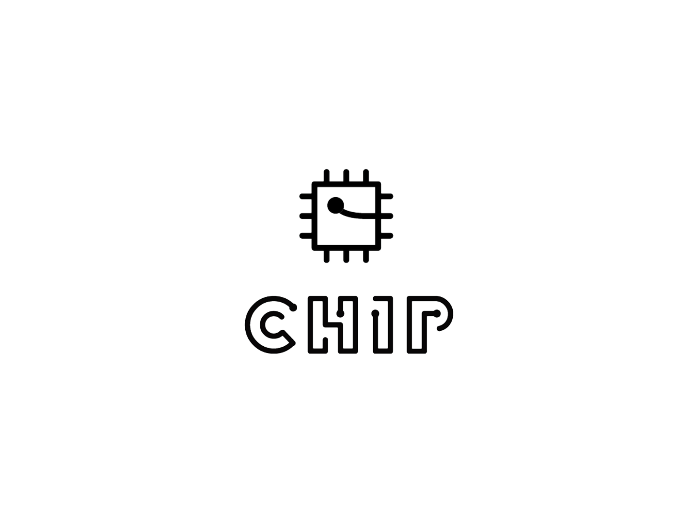

# Next Thing Co. - C.H.I.P.

## THIS IS UNDER ACTIVE DEVELOPMENT AND NOT READY FOR USE

[](https://travis-ci.org/nerves-project/nerves_system_chip)

This is the base Nerves System configuration for the [C.H.I.P.](http://getchip.com).


<br><sup>[Image credit](#fritzing)</sup>

| Feature              | Description                     |
| -------------------- | ------------------------------- |
| CPU                  | 1 GHz ARM Allwinner R8          |
| Memory               | 512 MB DRAM                     |
| Storage              | 4 GB eMMC Flash                 |
| Linux kernel         | 4.4.9                           |
| IEx terminal         | ttyS0 via FTDI pins             |
| GPIO, I2C, SPI       | Yes - Elixir ALE                |
| ADC                  | Yes                             |
| PWM                  | Yes, but no Elixir support      |
| UART                 | ttyS0 + more via device tree overlay  |
| Camera               | None                            |
| Ethernet             | No                              |
| WiFi                 | UNDER DEVELOPMENT               |
| Bluetooth            | UNDER DEVELOPMENT               |

## Console access

The console is configured to output to `ttyS0` by default. This is the
UART output accessible by the 6 pin header labeled J1. A 3.3V FTDI
cable is needed to access the output.

## Device tree overlays

TODO

### Universal I/O

The universal I/O overlays can be loaded manually or by using the `config-pin`
shell script:

```
iex(demo@nerves-0099)> :os.cmd('config-pin overlay cape-universaln')
'Loading cape-universaln overlay\n'
iex(demo@nerves-0099)> :os.cmd('config-pin -i P9_16') |> IO.puts
Pin name: P9_16
Function if no cape loaded: gpio
Function if cape loaded: default gpio gpio_pu gpio_pd pwm
Function information: gpio1_19 default gpio1_19 gpio1_19 gpio1_19 ehrpwm1B
Cape: cape-universala cape-universal cape-universaln
Kernel GPIO id: 51
PRU GPIO id: 83

:ok
iex(demo@nerves-0099)> :os.cmd('config-pin P9_16 pwm')
```

### ADCs

The following example shows how to read values from the 7 ADC inputs in Elixir.

```
iex(demo@nerves-0099)> File.write("/sys/devices/platform/bone_capemgr/slots","BB-ADC")
:ok
iex(demo@nerves-0099)> ls "/sys/bus/iio/devices/iio:device0"
buffer              dev                 in_voltage0_raw     in_voltage1_raw
in_voltage2_raw     in_voltage3_raw     in_voltage4_raw     in_voltage5_raw
in_voltage6_raw     name                of_node             power
scan_elements       subsystem           uevent
iex(demo@nerves-0099)> File.read("/sys/bus/iio/devices/iio:device0/in_voltage0_raw")
{:ok, "3891\n"}
iex(demo@nerves-0099)> File.read("/sys/bus/iio/devices/iio:device0/in_voltage0_raw")
{:ok, "3890\n"}
iex(demo@nerves-0099)> File.read("/sys/bus/iio/devices/iio:device0/in_voltage0_raw")
{:ok, "3891\n"}
```

## Supported USB WiFi devices

## Installation

If [available in Hex](https://hex.pm/docs/publish), the package can be installed as:

  1. Add nerves_system_chip to your list of dependencies in `mix.exs`:

        def deps do
          [{:nerves_system_chip, "~> 0.1.0"}]
        end

  2. Ensure nerves_system_chip is started before your application:

        def application do
          [applications: [:nerves_system_chip]]
        end


[Image credit](#fritzing): This image is from the [Fritzing](http://fritzing.org/home/) parts library.
